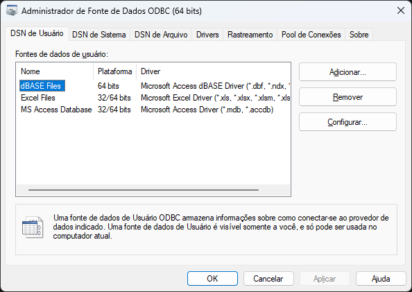

Microsoft SQL Server
====================

O `Microsoft SQL Server`_ é um sistema de gerenciamento de banco de dados relacional (RDBMS) desenvolvido pela Microsoft.

Ele é amplamente utilizado por empresas e organizações para armazenar, consultar e gerenciar grandes volumes de dados. O SQL Server oferece suporte a uma variedade de recursos, incluindo consultas SQL avançadas, procedimentos armazenados, funções definidas pelo usuário, gatilhos, replicação de dados, integração com outras tecnologias da Microsoft, como o .NET Framework, e ferramentas de administração robustas.

O SQL Server está disponível em várias edições, desde a versão Express gratuita até edições empresariais com recursos avançados de escalabilidade e segurança.

Dependências
------------

macOS
`````

.. code-block:: bash

    brew install \
    unixodbc

Arch Linux
```````````

.. code-block:: bash

    sudo pacman -S \
    unixodbc

Fedora
``````

.. code-block:: bash
    
    sudo dnf install \
    python3-devel \
    unixODBC-devel

Ubuntu e derivados
``````````````````

.. code-block:: bash

    sudo apt install \
    unixodbc-dev

pyodbc
------

`pyodbc`_ é um módulo Python que fornece uma interface para acessar bancos de dados utilizando ODBC (Open Database Connectivity).

O ODBC é uma API padrão da indústria para acessar bancos de dados, independentemente do sistema operacional em que o banco de dados esteja sendo executado.

O `pyodbc` permite que os desenvolvedores Python se conectem a uma ampla variedade de bancos de dados, como SQL Server, `Oracle`_, `MySQL`_, `PostgreSQL`_, `SQLite`_ e outros, usando o mesmo código, desde que o driver ODBC apropriado esteja instalado.

A sua instalação pode ser feita atravé do gerenciador de pacotes do Python:

.. code-block:: bash

    pip install pyodbc

Driver
------

Além do conector é necessária a instalação do **driver** do SQL Server.

- `Microsoft ODBC Driver for SQL Server (Windows) <https://learn.microsoft.com/pt-br/sql/connect/odbc/download-odbc-driver-for-sql-server>`_.
- `Microsoft ODBC Driver for SQL Server (Linux) <https://learn.microsoft.com/pt-br/sql/connect/odbc/linux-mac/installing-the-microsoft-odbc-driver-for-sql-server>`_.
- `Microsoft ODBC Driver for SQL Server (macOS) <https://learn.microsoft.com/pt-br/sql/connect/odbc/linux-mac/install-microsoft-odbc-driver-sql-server-macos>`_.

Cada versão do Microsoft SQL Server pode utilizar uma versão especifica do driver:

- **SQL Server**: Lançado com o SQL Server 2000.
- **SQL Native Client**: Lançado com o SQL Server 2005 (Também conhecido como versão 9.0).
- **SQL Server Native Client 10.0**: Lançado com o SQL Server 2008.
- **SQL Server Native Client 11.0**: Lançado com o SQL Server 2012.
- **ODBC Driver 11 for SQL Server**: Suporta o SQL Server 2005 até 2014.
- **ODBC Driver 13 for SQL Server**: Suporta o SQL Server 2005 até 2016.
- **ODBC Driver 13.1 for SQL Server**: Suporta o SQL Server 2008 Até 2016.
- **ODBC Driver 17 for SQL Server**: Suporta SQL Server 2008 Até 2017.
- **ODBC Driver 17 for SQL Server**: Suporta SQL Server 2008 Até 2017.
- **ODBC Driver 18 for SQL Server**: Suporta SQL Server 2019 ou superior.

No Microsoft Windows a gestão dos driver instalados podem ser realizada através do aplicativo com o aplicativo **Adminstrador de Fonte de Dados ODBC**:



Contêiner
---------

Os códigos de exemplo foram testados no contêiner:

.. literalinclude:: ../../src/mssql-server/docker-compose.yml

Exemplo prático
---------------

Vamos ver um exemplo simples de como usar o MariaDB para criar uma tabela e inserir alguns dados.

.. literalinclude:: ../../src/mssql-server/main.py

Exemplo prático com SQLAlchemy
------------------------------

.. literalinclude:: ../../src/mssql-server/main_sqlalchemy.py

.. _pyodbc: https://github.com/mkleehammer/pyodbc
.. _Microsoft SQL Server: https://www.microsoft.com/pt-br/sql-server/sql-server-downloads
.. _Oracle: https://www.oracle.com/database/
.. _MySQL: https://www.mysql.com/
.. _PostgreSQL: https://www.postgresql.org/
.. _SQLite: https://www.sqlite.org/
